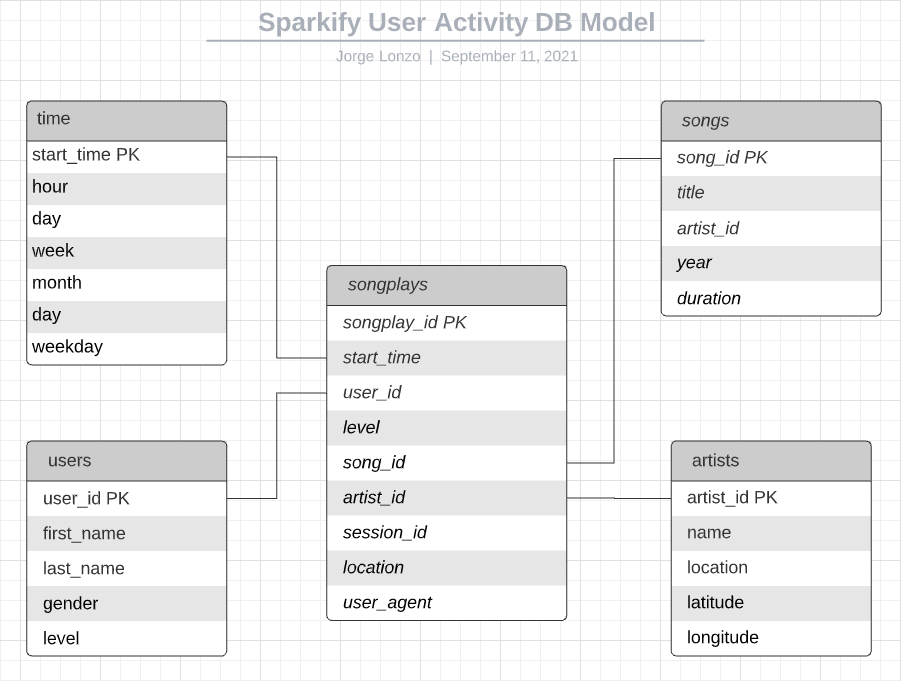

# Description:
This Repository is part of Udacity's Data Engineering Nano Degree Program 
It conntains the deliverables for **Project: Data Warehouse**

The purpose of the project is to provide Analytical Capabilities for a fictional Music Streaming Company called _Sparkify_
regarding User listening habits using a Star Schema Database Model to allow the extraction and access of high volumes of data 
in a fast manner.

## Dataset (Source)
The dataset is comprised of .json files located in AWS S3 Storage and distributed as follows:
* data/log_data - Files containing User listening history logs - `s3://udacity-dend/log_data`
* data/song_data - Files that containg Song, and Artists information - `s3://udacity-dend/song_data`

Example files are included in _data.zip_ file

## Database (Destination)
The destination is an AWS Redshift Cluster containing a DB called _sparkify_.  
See Project Pre-requisites for more details.

Following are the Table Structures for the Staging tables and Star Schema DW tables along with its ER Diagrams:

* Two Staging Tables 
	* staging_events: Entire contents of log_data json files -  
	  artist,auth,firstName,gender,itemInSession,lastName,length,level,location,method,page,registration,sessionId,song,status,ts,userAgent,userId
	* staging_songs: Entire contents of song_data json files -  
	  num_songs,artist_id,artist_latitude,artist_longitude,artist_location,artist_name,song_id,title,duration,year

* Four Dimension tables
    * artists: Artist information - artist_id,name,location,latitude,longitude
    * songs:   Song information - song_id,title,artist_id,year,duration
    * time:    User Listening Activity - start_time,hour,day,week,month,year,weekday
    * users:   user_id,first_name,last_name,gender,level

 * One Fact table
   * songplays: User Listening History - songplay_id,start_time,user_id,level,song_id,artist_id,session_id,location,user_agent

Star Schema DW ER Diagram:

## ETL Design and Workflow
Code repository contains one configuration file and three Python scripts:
1. _dwh.cfg_ Configuration file that including Parameters for the Redshift Cluster Connection
2. _create_tables.py_ Python Program that drops and recreates Staging and DW Tables inside the _sparkify_ DB
3. _sql_queries.py_ Contains the SQL queries used for droping, creating, and populating the tables
4. _etl.py_ Main Python program that performs the ETL process

Following is ETL Workflow:
1. _create_tables.py_ script needs to be run first in order to:
    * Drop/Create Staging Tables
    * Drop/Create Dimension and Fact tables (DW Tables)

2. Once the Database Structure has has been created, run the main program, _etl.py_ script, to perform the following ETL operations:
    * Parse through log_data .json files in order extract their content and load it into _staging_events_ table
    * Parse through song_data .json files in order extract their content and load it into _staging_songs_ table
    * Populate Fact and Dimension Tables using the Data loaded previously in the Staging Tables    

## Project Pre-Requisites
The following Tools and Modules are needed in order to to run the code in this repository:
* AWS Account
* Redshift Cluster holding a DB called _sparkify_  
  You can use included _RedshiftCluster_create.ipynb_ Jupyter Notebook file to create the Cluster
* Python Modules: 	
	* boto3
	* configarser
	* json
	* pandas
	* psycopg2 